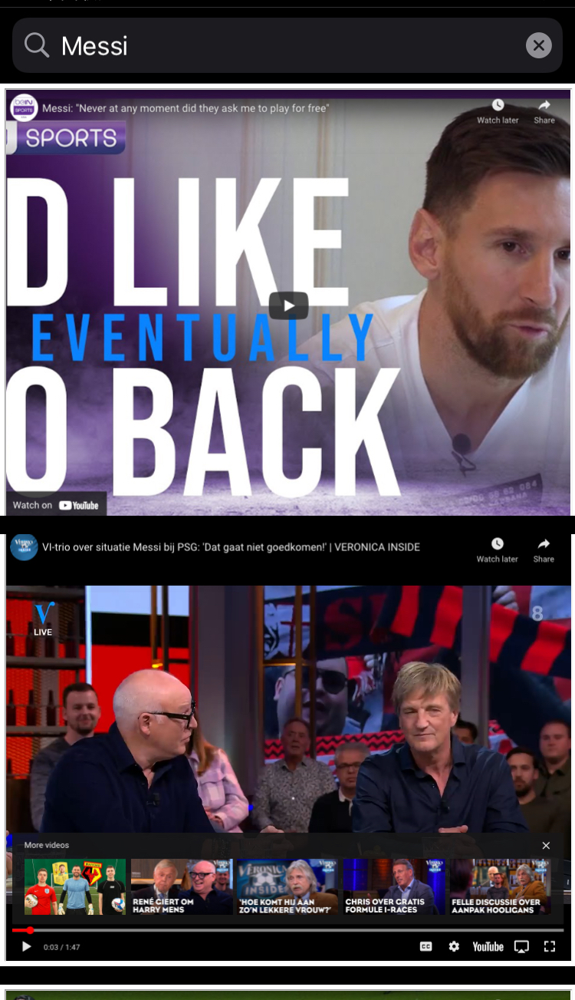

  
Tap Mobile Youtube test

  <h1>iOS Mobile Development</h1>

## 👋 Abstract

Your goal is to develop a search engine that pulls videos from Youtube.com(or Vimeo) and shows the embedded videos as output.
Design should contain a search box on top, and results + pagination.
You’ll need to embed iframes of the actual video results (only video
embeds without any other text elements).

## 🚀 Guidelines

1. You must use Regular expressions to parse youtube.com results.
2. You must not use the Youtube API for this task.
3. Please submit your result to a git repository and provide a link to it

#### Example query 
 "Ronaldo" Example url to parse: https://www.youtube.com/results?search_query=ronaldo

